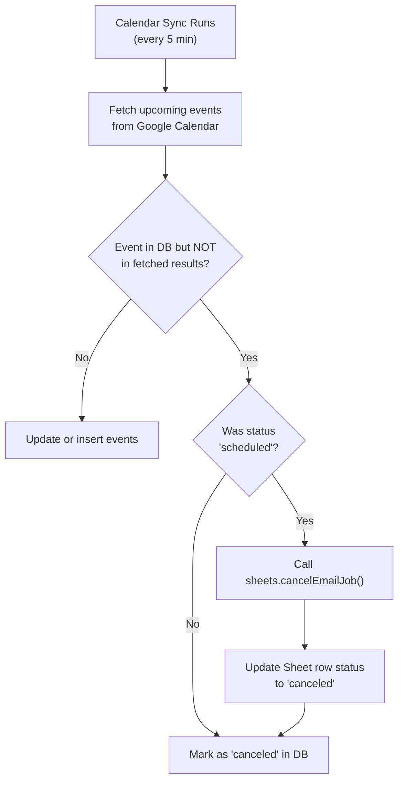

# Hermes Dashboard — Walkthrough

## Overview

The Hermes Dashboard is a local web application that connects to your **Google account** (OAuth 2.0), fetches events from Google Calendar, parses participant data, and manages automated reminder emails through a dark-mode dashboard UI.

**Key architecture decisions**:

- Emails are scheduled through **Google Sheets + Apps Script** so they send even when your PC is off. The local server writes scheduled jobs to a Google Sheet, and a time-driven Apps Script reads the Sheet and sends emails via `GmailApp`.
- **Every sent email is registered on the Google Sheet** — both scheduled emails (sent by Apps Script) and emails sent immediately from the dashboard (sent via the Gmail API) become rows on the Sheet. The Sheet is therefore a complete history of every email the system ever sent.
- **The local database is kept in sync by comparing the Calendar with the Sheet** — on every launch and every sync, calendar events are reconciled against the Sheet's records (e.g. an event the Sheet says was sent is marked `sent` in the DB, even if a stale calendar sync had it as `pending`/`past`/`canceled`).
- **Authentication persists across launches** — after the first "Connect Google Account", the OAuth refresh token is saved to `.env`, so later launches reconnect automatically (no consent screen).

---

## Project Structure

```
Hermes-Mailer/
├── server.js                  # Express entry point (async init, initial sync)
├── package.json               # Dependencies (sql.js, no native builds)
├── .env                       # Configuration (token auto-saved after first connect)
├── .gitignore                 # Ignores .env, node_modules, *.db
├── src/
│   ├── database.js            # SQLite via sql.js (pure JS, no native builds)
│   ├── auth.js                # OAuth 2.0 (Calendar, Sheets, Gmail) + token persistence
│   ├── calendar.js            # Google Calendar sync + event cancellation
│   ├── sheets.js              # Google Sheets email jobs + sent-status sync
│   ├── mailer.js              # Gmail API (Send Immediately)
│   ├── scheduler.js           # Schedule / cancel / send-now orchestration
│   └── routes.js              # All REST API endpoints
└── public/
    ├── index.html             # SPA shell with sidebar, tabs, modals
    ├── css/styles.css         # Full dark design system
    └── js/
        ├── api.js             # Fetch-based API client
        ├── app.js             # Tab navigation, event cards, toasts, search, force sync
        ├── modal.js           # Event detail modal with live email preview
        ├── templates.js       # Template CRUD management
        └── signatures.js      # Signature CRUD with rich text editor
```

---

## Features

### Pending events (upcoming)

Each pending event card has a template dropdown and two quick actions:

- **Schedule ⚡** (blue) — writes the email job to the Google Sheet; Apps Script sends it later.
- **Send Now ✉️** (green) — sends immediately via the Gmail API **and registers the email on the Sheet** with status `sent`.

Clicking the card opens the detail modal with a live email preview and the full Schedule / Send Now / Cancel actions.

### Scheduling behavior

- Scheduled emails go out **2 days before the event**, at the **global send hour** (default `20:00`).
- The send hour is configurable in the **Settings tab → Scheduling** section (0–23).
- The modal's past-cutoff alert uses the same configured hour.

### Sync & up-to-date data

- A **full sync runs on every app launch** (server-side after OAuth/startup, and again when the dashboard loads in the browser).
- `/api/sync` compares **Calendar data against Sheet data**: calendar events are added/updated/canceled, then every event that the Sheet marks as `sent` is set to `sent` in the local DB — so the dashboard is always in sync with the latest changes, even for emails sent while the app was closed.
- Calendar sync then repeats automatically every `SYNC_INTERVAL_MINUTES` (default 5), and sent-status sync every 2 minutes.
- A **Force Sync** button on the sidebar triggers the full compare manually.

### Sheets → Apps Script role

- Rows written with status `scheduled` are picked up by Apps Script at their `send_at` time.
- Rows written with status `sent` (Send Now from the dashboard) are **ignored by Apps Script** — they exist purely as the sent-email history used for the launch-time comparison.

---

## Event Cancellation Flow

> [!IMPORTANT]
> When a Google Calendar event is deleted, and the email was already scheduled, the email is automatically canceled on the Google Sheet.

The flow works as follows:



**Code locations**:
- [calendar.js](./src/calendar.js) — Detects deleted events and cancels Sheet jobs
- [sheets.js](./src/sheets.js) — `cancelEmailJob()` finds and updates the Sheet row
- [scheduler.js](./src/scheduler.js) — Manual cancel from dashboard UI

---

## Bugs Fixed During Review

| Bug | File | Fix |
|-----|------|-----|
| API responses wrapped in `{events}`, `{templates}` etc. but JS accessed bare arrays | app.js, modal.js, templates.js, signatures.js | Added `data.events \|\| data` destructuring |
| Google Calendar IDs are strings, not numbers — `onclick="handleFastSchedule(${id})"` broke | app.js | Switched to `addEventListener` with closure |
| Badge polling used `stats.new_canceled_count` but API returns `stats.newCanceledCount` | app.js | Fixed key name |
| Signature field name: DB uses `content`, JS used `body` | modal.js, signatures.js | Changed to `content` |
| Apps Script called `UrlFetchApp.fetch(localhost)` — unreachable from Google servers | index.html | Rewrote to use `SpreadsheetApp` + `GmailApp` directly |
| Email preview API: client sent POST, server expected GET | api.js | Changed to GET with URLSearchParams |
| `better-sqlite3` requires Python/C++ for native compilation | package.json, database.js | Replaced with `sql.js` (pure JavaScript SQLite) |
| `initDatabase()` became async (sql.js) but server called it synchronously | server.js | Wrapped in `async startServer()` |
| Rich text toolbar buttons had `data-command` but no event handlers | signatures.js | Added click handlers for all toolbar commands |
| Setup guide toggle replaced button `textContent`, losing the icon span | signatures.js | Fixed to toggle `hidden`/`active` and update icon only |
| Refresh token was saved as a **commented line** in `.env` (matched the template's `# GOOGLE_REFRESH_TOKEN=` placeholder), so dotenv ignored it and the app asked to reconnect every launch | auth.js | `persistRefreshToken()` now strips the comment marker when replacing an existing token line |

---

## Setup Instructions

### 1. Google Cloud setup

1. Create a project in [Google Cloud Console](https://console.cloud.google.com).
2. Enable the **Google Calendar API**, **Google Sheets API**, and **Gmail API**.
3. Create an **OAuth 2.0 Client ID** of type *Web application* and add the redirect URI:
   - `http://localhost:3000/auth/google/callback`
4. Put your app in **Published** status (Testing-mode refresh tokens expire after 7 days).

### 2. Configure `.env`

```env
# Google OAuth 2.0 (from Google Cloud Console → Credentials)
GOOGLE_CLIENT_ID=your-client-id.apps.googleusercontent.com
GOOGLE_CLIENT_SECRET=your-client-secret

# Your Google Calendar ID
GOOGLE_CALENDAR_ID=your-calendar@group.calendar.google.com

# Google Sheet ID (create a blank Sheet)
GOOGLE_SHEET_ID=1abc...xyz

# Sender display name
EMAIL_FROM_NAME=Your Name

# Server
PORT=3000
SYNC_INTERVAL_MINUTES=5
```

`GOOGLE_REFRESH_TOKEN` is **auto-generated** after the first connection — do not comment that line out (a commented placeholder is what used to force re-connecting every launch).

### 3. First run

```bash
npm start
```

The dashboard opens automatically at `http://localhost:3000`. Click **Connect Google Account**, accept the permissions, and you're done — subsequent launches authenticate automatically with the saved refresh token.

### 4. Apps Script Setup (for offline email sending)

1. Open your Google Sheet → **Extensions → Apps Script**
2. Paste the code from the **Setup Guide** section in the dashboard's Settings tab (`processScheduledEmails`)
3. Run it once to authorize, then set a **1-minute time-driven trigger**
4. The script will now send due `scheduled` rows every minute — even when your PC is off

### 5. Calendar Event Format

Events should have descriptions in the format:

```
Participant: FirstName LastName (email@example.com)
```

The event title can use `Event Name - Extra Info` format (only the part before ` - ` is used as the event name).