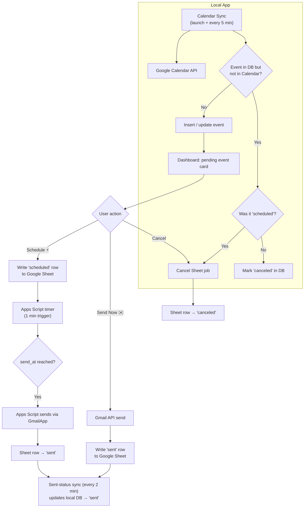
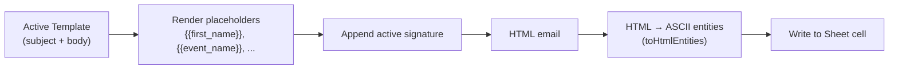

<div align="center">


# Hermes Dashboard

**Google Calendar Email Automation Dashboard** — a local web app that turns calendar events into automatic reminder emails.

</div>

---

## What is Hermes?

Hermes is a self-hosted, dark-mode dashboard that connects to your **Google account** (OAuth 2.0) and automates email reminders for your calendar events. It fetches events from **Google Calendar**, parses the participant and event data from each event's description, and lets you either:

- **Schedule** a reminder email that goes out **2 days before the event** — handled by **Google Apps Script**, so it fires even when your PC is off — or
- **Send immediately** via the Gmail API.

Emails are composed from fully editable **templates** and **signatures**, and every email the system ever sends is recorded on a **Google Sheet** that acts as the complete send history.

## Features

- **Google OAuth 2.0** — one-time "Connect Google Account" flow; the refresh token is persisted in `.env` so future launches reconnect silently (no consent screen).
- **Automatic event sync** — events are fetched from Calendar on every launch, then every 5 minutes. Deleted events are detected and their scheduled emails are **automatically canceled** on the Sheet.
- **Schedule emails** — reminder emails are written as jobs to a Google Sheet; a time-driven Apps Script picks them up at their `send_at` time and sends them via Gmail — **even when the app is closed**.
- **Send Now** — sends instantly via the Gmail API and still registers the email on the Sheet as a `sent` row.
- **Sent-status reconciliation** — the Sheet's `sent` rows are synced back into the local database every 2 minutes, so the dashboard always reflects emails sent while it was offline.
- **Smart scheduling defaults** — emails go out 2 days before the event at a configurable global hour (default `20:00`), with a past-cutoff guard that suggests "Send Now" when the window has passed.
- **Event detail modal** — live email preview rendered from the active template before you commit.
- **Templates & Signatures** — full CRUD management, rich text editor for signatures, `{{first_name}}`, `{{event_name}}`, `{{event_day}}`, `{{event_time}}` and other placeholder variables.
- **Cancellation handling** — deleting a calendar event cancels its pending job on the Sheet, and canceled events are surfaced in the dashboard with a badge counter.
- **Pure JavaScript stack** — no native compilation needed (`sql.js` instead of `better-sqlite3`).

---

## Your Data & Privacy

Hermes is a **local application** — it runs entirely on your machine, stores its data in a local SQLite file (`hermes.db`), and communicates only with Google's APIs on your behalf. There is no third party, no telemetry, and no external server in the loop.

### What the app can access

When you click **Connect Google Account**, you grant Hermes the following OAuth 2.0 scopes:

| Scope | What it lets Hermes do |
|-------|------------------------|
| `calendar.readonly` | Read events from your Google Calendar (read-only — it can never create, edit, or delete events it does not own) |
| `spreadsheets` | Read and write the email job/history spreadsheet you configured in `.env` |
| `gmail.send` | Send emails on your behalf (send-only — it cannot read your inbox, drafts, or contacts) |
| `userinfo.email` | Read the email address of the connected account, used for the dashboard header |

### Where your data lives

- **Local SQLite database** (`hermes.db`) — event records (name, participant name, email, datetime), templates, signatures, and settings. Never leaves your machine.
- **Your Google Sheet** — every email job and every sent email is a row here. Columns: `event_id`, `to_email`, `subject`, `body`, `send_at`, `status`, `sent_at`. This is the bridge that lets Apps Script send emails while your PC is off.
- **`.env` file** — stores your OAuth client credentials and the auto-generated refresh token, exactly like any standard OAuth app.

### What you should know

- Email bodies and subjects are stored **in plain text** in the Google Sheet and the local database, so anyone with access to either can read them.
- The Apps Script code you paste into the Sheet (see Setup) has full Gmail **send** access to your account by design — that is the entire point of the offline scheduler. Review it before authorizing.
- Your refresh token grants the app continued access until revoked. Use the **Disconnect Google Account** button in the dashboard to revoke access and wipe the token from `.env` when you no longer need the app.
- Google's own data policies apply to anything processed by Calendar, Sheets, Gmail, and Apps Script.

### About the Google Cloud Project

A **Google Cloud Project** is the container Google requires to use its APIs with OAuth 2.0. In the Google Cloud Console you or an administrator:

1. Create the project,
2. Enable the **Calendar API**, **Sheets API**, and **Gmail API** for it,
3. Create an **OAuth 2.0 Client ID** (Web application type) with the redirect URI `http://localhost:3000/auth/google/callback`.

The project itself does not process or store your data — it is purely the identity/authorization layer. Hermes talks directly to the APIs; Google's consent screen shows exactly which scopes the project's client ID is requesting. **Keep the client ID and secret out of version control** (the included `.gitignore` already excludes `.env`).

---

## Architectural Decisions

The design favors **Google infrastructure over local processes** for anything that must survive your PC being off:

1. **Emails are scheduled through Google Sheets + Apps Script, not a local cron/timer.** A local scheduler dies with your machine; a time-driven Apps Script trigger on the Sheet doesn't. The local server's only job is to write `scheduled` jobs to the Sheet and let Apps Script do the sending at `send_at` time.

2. **The Sheet is the single source of truth for email history.** Both paths — Apps Script sending scheduled jobs and the dashboard's "Send Now" — produce a row on the Sheet (`scheduled`/`sent`/`canceled`). The Sheet is therefore a complete, human-inspectable audit log of every email the system ever sent.

3. **Calendar is reconciled against the Sheet on every launch and every sync.** Events are added/updated/canceled from Calendar, then any event the Sheet marks as `sent` is forced to `sent` in the local DB — even if a stale sync had it as `pending`/`past`/`canceled`. This catches up on emails sent by Apps Script while the app was closed, and avoids status ping-pong between the two syncs.

4. **The Sheet data is pure ASCII to survive the round trip.** Email HTML is encoded to HTML numeric character entities (`toHtmlEntities`) before being written to cells, so accents and emoji survive Google Sheets → Apps Script → Gmail without corruption.

5. **No native modules.** `sql.js` (a pure-JS SQLite) replaces `better-sqlite3`, keeping `npm install` free of Python/C++ build requirements on any platform.

6. **OAuth tokens persist across launches.** The refresh token is written back into `.env` (carefully uncommenting the template placeholder line) so restarts authenticate automatically — and `Disconnect` revokes it server-side plus removes it from `.env`.

7. **Watchful cancellation.** Calendar sync treats any active event that vanished from the calendar as deleted and, if an email was scheduled for it, cancels the matching Sheet row so Apps Script never sends an orphaned email.

---

## Project Structure

```
Hermes/
├── server.js                  # Express entry point (async init, OAuth routes, sync intervals)
├── package.json               # Dependencies (dotenv, express, googleapis, sql.js, pkg)
├── .env                       # Configuration (client ID/secret, calendar & sheet IDs, token auto-saved)
├── env.template               # Fresh configuration template (auto-copied to .env on first run)
├── .gitignore                 # Ignores .env, node_modules, *.db, dist/, ldid
├── Hermes-Logo.png            # Project logo
├── hermes.db                  # Local SQLite database (auto-generated)
├── scripts/
│   ├── build-executables.js      # Cross-compiles all platform executables into dist/
│   └── install-linux-desktop.js  # Installs the Fedora/Linux app-grid shortcut
├── dist/                      # Built executables (Linux, Windows .exe, macOS .app bundles)
├── src/
│   ├── database.js            # SQLite schema + data access layer (sql.js, pure JS)
│   ├── auth.js                # OAuth 2.0 (Calendar, Sheets, Gmail) + token persistence/revocation
│   ├── calendar.js            # Google Calendar fetch, participant parsing, sync + cancellation
│   ├── sheets.js              # Google Sheets job writer, cancelEmailJob, sent-status sync
│   ├── mailer.js              # Gmail API sending, template rendering, UTF-8/HTML-entity handling
│   ├── scheduler.js           # Schedule / cancel / send-now / send-time calculation
│   ├── paths.js               # Portable path resolution (repo vs packaged executables)
│   └── routes.js              # All REST API endpoints
└── public/
    ├── index.html             # SPA shell (sidebar, tabs, modals)
    ├── css/styles.css         # Dark design system
    └── js/
        ├── api.js             # Fetch-based API client
        ├── app.js             # Tab navigation, event cards, toasts, search, force sync
        ├── modal.js           # Event detail modal with live email preview
        ├── templates.js       # Template CRUD management
        └── signatures.js      # Signature CRUD with rich text editor
```

## Flow: Scheduling & Sending



## Flow: Email Composition



---

## One-Click Executables

Hermes ships as **standalone executables** for Fedora/Linux, Windows and macOS — the Node.js runtime, all code, and the dashboard frontend are embedded into a single binary. **No Node.js installation is needed.** Users only open the file; the server starts, the browser opens the dashboard, and a `.env` file is auto-created next to the binary on first run.

### Files in `dist/` (built with `npm run build`)

| File | OS | How to run |
|------|----|------------|
| `hermes-dashboard-linux-x64` | Fedora / any Linux x86_64 | Double-click, or run `./hermes-dashboard-linux-x64` |
| `hermes-dashboard-win-x64.exe` | Windows 64-bit | Double-click the .exe |
| `Hermes-dashboard-macos-x64.app` | macOS Intel | Double-click, then drag into **/Applications** |
| `Hermes-dashboard-macos-arm64.app` | macOS Apple Silicon | Double-click, then drag into **/Applications** |

### Portable behavior

The executable is **fully portable**: `.env`, `hermes.db`, and `sql-wasm.wasm` are created in the same folder as the binary (put it in a writable folder, e.g. `~/Hermes` or the Desktop). Configuration is identical to the repo version — fill `.env` with your Google credentials and restart.

### Adding the OS app shortcut

- **Fedora / GNOME** — from the repo:

  ```bash
  npm run build
  npm run install-desktop
  ```

  The app then appears in the Activities overview and can be pinned to the dock. (Manually: the build also writes `dist/hermes.desktop` — copy it to `~/.local/share/applications/` and the logo to `~/.local/share/icons/`.)
- **Windows** — right-click `hermes-dashboard-win-x64.exe` → **Pin to taskbar**, or create a shortcut on the Desktop / Start Menu.
- **macOS** — drag the `.app` bundle into **/Applications**; it appears in Launchpad and Spotlight automatically.

### Platform notes

- **macOS Gatekeeper**: binaries built on Linux are ad-hoc signed (`ldid`) but not notarized. The first launch may require **right-click → Open** instead of a plain double-click.
- **Windows SmartScreen**: unsigned exes may warn "Unknown publisher" — click **More info → Run anyway**.
- Don't move a binary after first run, or copy the `.env`/`hermes.db` files along with it.

### Rebuilding

```bash
npm install          # includes devDependency pkg
npm run build        # cross-compiles all 4 executables into ./dist
```

The build script (`scripts/build-executables.js`) invokes `pkg` for `node18-linux-x64`, `node18-win-x64`, `node18-macos-x64` and `node18-macos-arm64`, then wraps the macOS binaries into `.app` bundles (ad-hoc signing applied when `ldid` is available).

---

## Setup Instructions

### 1. Google Cloud setup

1. Create a project in [Google Cloud Console](https://console.cloud.google.com).
2. Enable the **Google Calendar API**, **Google Sheets API**, and **Gmail API**.
3. Create an **OAuth 2.0 Client ID** of type *Web application* and add the redirect URI:
   - `http://localhost:3000/auth/google/callback`
4. Put your app in **Published** status (Testing-mode refresh tokens expire after 7 days).

### 2. Configure `.env`

```env
# Google OAuth 2.0 (from Google Cloud Console → Credentials)
GOOGLE_CLIENT_ID=your-client-id.apps.googleusercontent.com
GOOGLE_CLIENT_SECRET=your-client-secret

# Your Google Calendar ID
GOOGLE_CALENDAR_ID=your-calendar@group.calendar.google.com

# Google Sheet ID (create a blank Sheet)
GOOGLE_SHEET_ID=1abc...xyz

# Sender display name
EMAIL_FROM_NAME=Your Name

# Server
PORT=3000
SYNC_INTERVAL_MINUTES=5
```

`GOOGLE_REFRESH_TOKEN` is **auto-generated** after the first connection — do not comment that line out.

### 3. First run

```bash
npm start
```

The dashboard opens automatically at `http://localhost:3000`. Click **Connect Google Account**, accept the permissions, and you're done — subsequent launches authenticate automatically with the saved refresh token.

### 4. Apps Script Setup (for offline email sending)

1. Open your Google Sheet → **Extensions → Apps Script**
2. Paste the code from the **Setup Guide** section in the dashboard's Settings tab (`processScheduledEmails`)
3. Run it once to authorize, then set a **1-minute time-driven trigger**
4. The script will now send due `scheduled` rows every minute — even when your PC is off

### 5. Calendar Event Format

Events should have descriptions in the format:

```
Participant: FirstName LastName (email@example.com)
```

The event title can use `Event Name - Extra Info` format (only the part before ` - ` is used as the event name).

---

## AI Disclosure

This project was **entirely developed using AI assistance**. Initial development was done with **Claude Opus 4.6 (Thinking)** through **Google Antigravity**, and later development switched to **DeepSeek V4 Flash Free (max)** through **OpenCode**. The Hermes logo was generated with **Gemini 3.6 Flash**.

All code, architecture decisions, and documentation were produced through these AI tools; human review and testing was performed by the project maintainer.